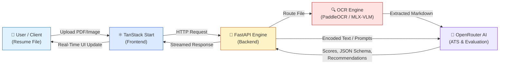
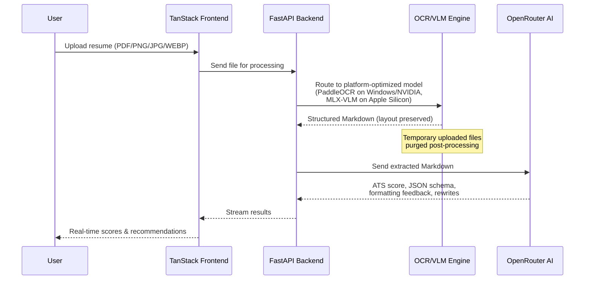

# 📄🤖 AI Resume Parser

An end-to-end full-stack application built to explore OCR document processing and Vision-Language AI Models (VLMs). It parses resume documents into structured JSON data, extracts visual layout markdown, and evaluates ATS (Applicant Tracking System) compliance with actionable AI feedback.

## 🏗️ System Architecture



## 🔄 Data Flow Workflow



**Workflow steps:**

1. **File Upload** — The user uploads a multi-page PDF or image (`.png`, `.jpg`, `.webp`) via the TanStack React UI.
2. **Backend Ingestion** — The file is sent to the FastAPI backend service for processing.
3. **OCR / VLM Extraction** — The file is routed to platform-optimized local models (PaddleOCR on Windows/NVIDIA or MLX-VLM on Apple Silicon) to convert the visual layout into structured Markdown. *(Note: Uploaded temporary files are purged post-processing.)*
4. **ATS Scoring & Analysis** — The extracted Markdown is sent to OpenRouter AI models to analyze parser compatibility, evaluate layout formatting, extract JSON schemas, and produce actionable rewrites.
5. **Streamed UI Render** — The UI receives state updates and streams back real-time scores, structured JSON schemas, and formatting recommendations.

## 🛠️ Tech Stack

| Domain | Technologies |
|---|---|
| Frontend | React, TanStack Start, TanStack Query, Tailwind CSS |
| Backend | Python 3.12, FastAPI, Uvicorn |
| OCR / VLM Engines | **Windows (NVIDIA GPU):** PaddleOCR, PaddlePaddle GPU, vLLM<br>**macOS (Apple Silicon):** MLX-VLM |
| AI Integrations | OpenRouter API (LLM for scoring, JSON schema conversion & feedback) |

## ⚡ Key Features

- **Multi-Format Ingestion** — Native parsing support for multi-page PDFs, `.png`, `.jpg`, and `.webp` documents.
- **Layout-Aware Extraction** — Uses advanced local VLM/OCR pipelines to preserve document spatial hierarchy and structure into Markdown.
- **ATS Evaluation Engine** — Automatically evaluates key metrics: keyword density, section formatting, and readability scores.
- **Structured Data Export** — Converts raw extracted text into clean, validated JSON schemas (Skills, Work Experience, Education).
- **Real-Time Streamed UX** — Responsive state-driven user interface leveraging TanStack Start & Query.

## 📁 Repository Structure

```
.
├── src-backend/          # FastAPI server & AI model execution engines
│   ├── routes/          # API endpoint routes
│   ├── main.py          # FastAPI application entry point
│   └── requirements.txt # Standard Python dependencies
└── src/                 # TanStack web application frontend
```

## 🚀 Getting Started

### Prerequisites

- **Node.js:** v18.0.0 or higher (pnpm recommended)
- **Python:** v3.12.*
- **OpenRouter API Key:** Obtainable from OpenRouter.ai
- **Hardware Requirements:**
  - Windows: NVIDIA GPU with CUDA 12.x drivers installed.
  - macOS: Apple Silicon (M1/M2/M3/M4) running macOS Monterey or later.

### 1. Environment Setup

Create a `.env` file in the root directory:

```
OPENROUTER_API_KEY=your_openrouter_api_key_here
```

### 2. Backend Installation

Navigate to the backend directory and set up a Python virtual environment:

```bash
cd src-backend
python -m venv venv

# Activate on Windows:
.\venv\Scripts\activate

# Activate on macOS/Linux:
source venv/bin/activate

# Install core dependencies
pip install -r requirements.txt
```

### ⚠️ Platform-Specific AI Extensions

Run one of the following setups based on your operating platform:

**Option A: Windows (NVIDIA GPU / CUDA 12.x)**

```bash
# Install CUDA-enabled PaddlePaddle GPU engine
python -m pip install paddlepaddle-gpu==3.2.1 -i https://www.paddlepaddle.org.cn/packages/stable/cu129/

# Install PaddleOCR with document parsing extensions
python -m pip install -U "paddleocr[doc-parser]"

# Install GenAI server dependencies (vLLM inference acceleration)
paddleocr install_genai_server_deps vllm
```

**Option B: macOS (Apple Silicon)**

```bash
# Install MLX Vision-Language Model framework optimized for Metal GPUs
pip install "mlx-vlm>=0.3.11"
```

## 3. Application Launch

Once the required dependencies are installed, you can continue with the following instructions.

### Go to root project directory
```bash
# Start app on Windows
npm run dev:windows

# Start app on MacOS
npm run dev:macos
```

## 🤝 Contributing

Contributions, feature suggestions, and pull requests are welcome! If you find bugs or want to experiment with alternative VLM backends, feel free to open an issue or submit a PR.